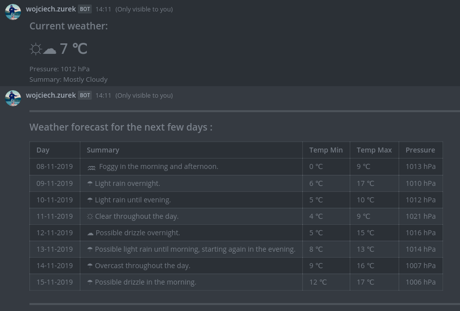
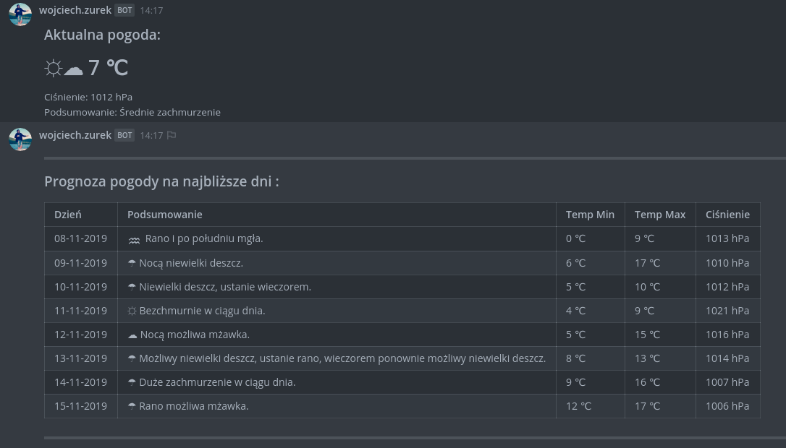

# mattermost-darksky
Mattermost weather slash command application. 
This app shows weather forecasts and current conditions from Dark Sky.





More info:
- https://mattermost.com/
- https://developers.mattermost.com/integrate/slash-commands/
- https://darksky.net/dev

## Supported languages:

- english (theme, dark sky api response)
- polish (theme, dark sky api response)
- other (dark sky api response)

## Supported Mattermost response type:
- ephemeral
- in_channel

## Endpoints

Server: [http://localhost:8080](http://localhost:8080)

```
    GET /api/weather/current/{location}
    GET /api/weather/daily/{location}
```
where location = [latitude],[longitude].
Example for location: 50.04180,21.99999
```
    http GET :8080/api/weather/current/50.04180,21.99999
```

## Dark Sky Api Key
You must have your own api key from Dark Sky.
You can pass your api key in few different ways:
- application.properties
```
    darksky.api.key=000000
```
- environment variable
```
    DARKSKY_API_KEY=000000
```
for example:
```
    docker run -p 8080:8080 -e DARKSKY_API_KEY='000000' eu.wojciechzurek/mattermost-darksky:latest
```

- request
```
    http GET :8080/api/weather/current/50.04180,21.99999\?lang=en\&apiKey=000000
```
## Download

```bash
    git clone git@github.com:wojciech-zurek/mattermost-darksky.git
```

## Run with gradle

```bash
    cd mattermost-darksky/
    ./gradlew bootRun
```

## Run as jar file

```bash
    cd mattermost-darksky/
    ./gradlew bootJar
    java -jar build/libs/mattermost-darksky-0.0.1-SNAPSHOT.jar
```

## Build Docker image

```bash
    cd mattermost-darksky/
    ./build.sh
```

## Run Docker image

```bash
    docker run -p 8080:8080 eu.wojciechzurek/mattermost-darksky:latest
```